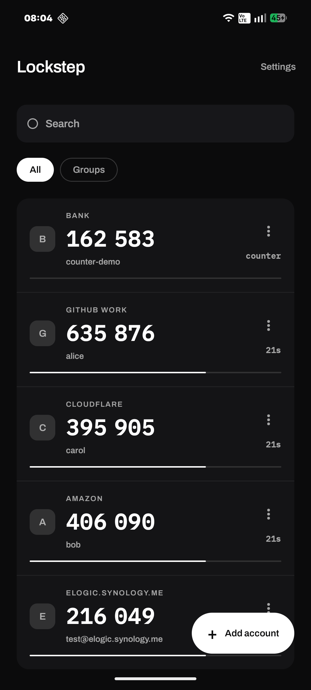
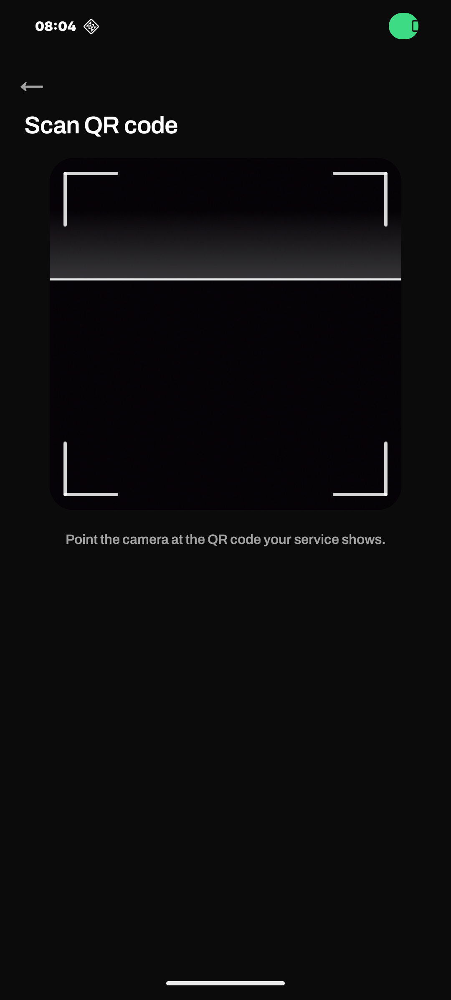
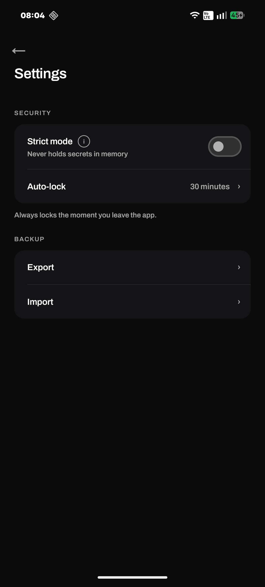

# Lockstep

**Two-factor codes that never leave your phone.**

Lockstep is a free, open-source two-factor authentication app for Android. It generates the
sign-in codes your accounts ask for, entirely on your device — no account to create, no cloud
to sync with, and no internet permission at all.

<p align="center">
  
  
  
</p>

## Why Lockstep

### Your codes never leave the device

There is no Lockstep account, no server, and nothing to sign up for. The app doesn't request
internet access at all — you can check that yourself in its permissions. The only permission it
asks for is the camera, and only when you scan a QR code.

### Locked behind your fingerprint

Every secret is encrypted with a key held in the Android Keystore, hardware-backed on devices
that support it. That key only works once you've authenticated, so anyone who copies the app's
database off your phone gets ciphertext and nothing else.

### Backups you own

Export an encrypted backup whenever you want, protected by a password you choose and hardened
with Argon2id. Keep the file wherever you trust. Restoring adds your accounts back alongside
whatever is already there, so a restore can never wipe what you have.

### Quick to use under pressure

Codes are large and easy to read at a glance. Tap one to copy it and the clipboard clears itself
shortly after. Group your accounts, search them, and drag them into whatever order suits you.

## Features

- **Scan or type** — add accounts by QR code or by entering a setup key by hand
- **Check before you add** — scanned codes show you what they are before anything is saved
- **Groups** — organise accounts into groups and filter with a tap
- **Search** — find an account by service or username
- **Tap to copy** — copies the code, then clears the clipboard on its own
- **Hold to reorder** — drag accounts into the order you want
- **TOTP and HOTP** — both time-based and counter-based codes
- **Encrypted backup and restore** — password-protected, and the file is yours
- **Auto-lock** — locks on a timer you set, and the moment you leave the app
- **Light and dark** — follows your system theme

## Security at a glance

| | |
|---|---|
| Secrets at rest | AES-256-GCM, key held in the Android Keystore, hardware-backed where available |
| Unlocking | Fingerprint or device PIN, enforced by the operating system |
| On screen | Codes are kept out of screenshots and the app switcher |
| Clipboard | Copied codes are flagged sensitive and cleared automatically |
| Backups | Password-derived key using Argon2id |
| Network | No internet permission is requested |
| Device backup | Excluded from Android's automatic cloud backup |

## Install

Lockstep is working toward its first release. When v1 ships it will be available as a signed APK
here on GitHub and through F-Droid.

Watch this repository to hear when it lands.

## Requirements

- Android 11 (API 30) or newer
- A screen lock set, with a fingerprint enrolled

## Building from source

```sh
git clone https://github.com/Subhayan0022/authenticator-app.git
cd authenticator-app
./gradlew assembleDebug
```

Unit tests run on the JVM without a device or emulator:

```sh
./gradlew test
```

## Licence

Apache-2.0. See [LICENSE](LICENSE).
